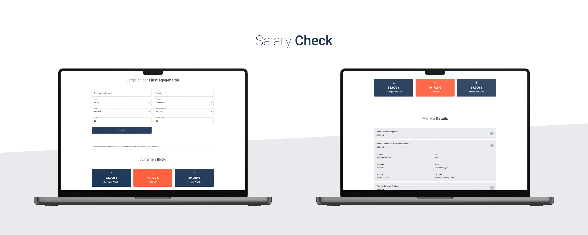

# Salary **Check**

## Über Salary Check

Salary Check ist als Vergleichsportal für Einstiegsgehälter im Bereich der Software Entwicklung gedacht. Mithilfe der erhobenen Daten wird unter anderem das Durchschnittsgehalt ermittelt. So erhält man bereits vor seiner Gehaltsverhandlung einen kleinen Überblick über mögliche Verhandlungsansätze.

### Technologien:

  

### Skripte:

`npm start`

> Startet die Applikation lokal.

`npm run build`

> Generiert den **build** Ordner.
